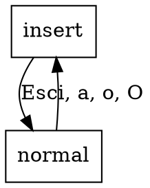

# Multi-line TUI — Design

> Successor to the M4 v1 TUI. Adds a vim-style modal editor with a
> pipe-friendly slot API, deferred-eval timing, and minimal-chrome activity
> feedback. Drop-in replacement for `src/tui.jl`.

## 1. Goal

Make Ressac's TUI usable for actual live performance: terse to type, cheap
on screen real estate, supports mid-cycle pattern swaps without audible
glitches, and frees the user's attention from "what's playing where" so
they can focus on the next move.

## 2. UX walkthrough

```
┌─ ressac ─ 0.5cps ▹▹▹▸ │ d1•◦◦◦ d2◦•◦• d3 ⏱→cyc7      NORMAL ┐
│                                                              │
│ @d1  p"bd hh sn hh"          |> fast(2)                  ▶ │
│ @d2  p"cp ~ cp cp"           |> every(4, rev)             ▶ │
│                                                              │
│ @d3  p"arpy:0 arpy:1"        |> stack(p"~ cp ~")             │
│ ^                                                            │
│ # essai en cours :                                           │
│ @d1  p"bd*4 sn"                                              │
└──────────────────────────────────────────────────────────────┘
[INFO] queued d1 → cycle 7
```

A user session looks like:
1. `i` → insert mode, type `@d1 p"bd hh sn hh" |> fast(2)`.
2. `Esc` → normal mode.
3. `e` → eval at cursor, immediate. Hear it.
4. Edit in place, `2e` → eval at +2 cycles. Hear the swap at the next
   musical boundary.
5. `m` on a line → comment it out, scheduler unsets the slot.
6. `gd1` → jump to the latest `@d1` def. `N` → previous `@d1`.

## 3. Live API

### 3.1 Slot macros

Generate `@d1`, `@d2`, …, `@d16` macros at module load. Each expands its
body verbatim into a `Ressac._route_to_slot!(:dN, body)` call:

```julia
@d1 p"bd hh sn hh" |> fast(2)
# expands to
Ressac._route_to_slot!(:d1, p"bd hh sn hh" |> fast(2))

@d1            # no body
# expands to
Ressac._route_to_slot!(:d1)   # unsets the slot
```

`_route_to_slot!` reads the module-level `_EVAL_MODE` flag and dispatches
to `set_pattern!` or `schedule_pattern!`. Macros are generated in a loop
in `src/live_api.jl` to keep the source DRY.

### 3.2 Curried combinator forms

Add one-arg curried methods so `|>` threads a `Pattern` as the would-be
first arg of the underlying full-arg call:

| Combinator | New curried form | Resulting pipe |
|---|---|---|
| `fast(n, p)` | `fast(n)` | `p \|> fast(n)` |
| `slow(n, p)` | `slow(n)` | `p \|> slow(n)` |
| `rev(p)` | already 1-arg | `p \|> rev` |
| `every(n, f, p)` | `every(n, f)` | `p \|> every(n, f)` |
| `mask(p, q)` | `mask(q)` | `p \|> mask(q)` |
| `stack(p, q)` | `stack(q)` | `p \|> stack(q)` |
| `cat([…])` | unchanged | `cat([p, q])` |

Existing 2-arg signatures stay. Multiple dispatch picks the right
overload. No macros, no AST rewriting.

For arg-capture at non-first positions (rare), users write an
anonymous fn: `p |> (x -> stack(other, x))`. Vendoring `Chain.jl` is
deferred until there's evidence we need it.

### 3.3 Scheduler timing — `pending` queue

Extend the `Scheduler` struct:

```julia
mutable struct Scheduler{C}
    patterns::Dict{Symbol, Pattern}
    pending::Dict{Symbol, Tuple{Pattern, Rational{Int64}}}  # NEW
    last_fired_at::Dict{Symbol, Float64}                     # NEW (for blink)
    cps::Float64
    lookahead::Float64
    osc::C
    running::Threads.Atomic{Bool}
    t_start::Float64
    last_end_cycles::Float64
    lock::ReentrantLock
end
```

New function `schedule_pattern!(s, slot, p, at_cycle::Rational{Int64})`
takes the lock and inserts into `pending`. New helper
`_current_cycle(s) = (time() - s.t_start) * s.cps`.

In `_step!`, before the existing per-pattern loop, drain any
pending entries whose `at_cycle ≤ end_cycles` into `patterns`:

```julia
for (slot, (p, at)) in pairs(s.pending)
    if at <= end_cycles
        s.patterns[slot] = p
        delete!(s.pending, slot)
    end
end
```

Because the `_step!` runs before each new lookahead query, the new
pattern is queried for cycle `at` and beyond — clean cycle-boundary
swap, no half-cycle audio mix.

Per-slot `last_fired_at[slot] = time()` is set inside the inner event
loop whenever an event ships. The TUI reads this to drive the
activity-widget blink.

### 3.4 `_EVAL_MODE` flag

```julia
const _EVAL_MODE = Ref{Tuple{Symbol,Int}}((:immediate, 0))

function _route_to_slot!(slot::Symbol, p::Pattern)
    sched = _check_live()
    mode, n = _EVAL_MODE[]
    if mode == :immediate
        set_pattern!(sched, slot, p)
    else  # :deferred
        target = Rational{Int64}(ceil(Int, _current_cycle(sched)) + n)
        schedule_pattern!(sched, slot, p, target)
    end
end

_route_to_slot!(slot::Symbol) = unset_pattern!(_check_live(), slot)
```

The TUI sets the flag before `Core.eval(Main, …)`, restores it in a
`finally`. Thread safety: only the TUI thread mutates the flag and
calls `Core.eval`; the scheduler thread only reads `patterns` /
`pending`. ReentrantLock on the Scheduler guards those.

## 4. TUI architecture

### 4.1 `LiveModel` extension

```julia
@kwdef mutable struct LiveModel <: TUI.Model
    scheduler::Scheduler
    buffer::Vector{String}        = [""]   # one entry per line
    cursor_row::Int               = 1
    cursor_col::Int               = 1      # 1-based byte index into buffer[row]
    mode::Symbol                  = :insert
    count_prefix::Int             = 0      # for `[N]e`
    pending_chord::Symbol         = :none  # :gd → next char picks digit
    last_eval_block::Dict{Symbol, NTuple{2,Int}} = Dict()  # slot → (row_start, row_end)
    last_search_slot::Symbol      = :none  # for n/N cycling after gd
    logs::Vector{String}          = String[]
    quit::Bool                    = false
end
```

`history` and `input` from v1 are gone — the buffer is the new editor.

### 4.2 Mode state machine



`i` enters insert at cursor. `a` after cursor. `o` opens a new line
below. `O` opens above. `Esc` returns to normal.

### 4.3 Insert-mode bindings

| Key | Action |
|---|---|
| any printable | insert char at cursor, advance cursor |
| `Enter` | split current line at cursor; cursor goes to start of new line |
| `Backspace` | delete prev char; if at col 1, join with previous line |
| `←` `→` | move cursor 1 col |
| `↑` `↓` | move cursor 1 row (preserves col within bounds) |
| `Esc` | switch to normal mode |

### 4.4 Normal-mode bindings

| Key | Action |
|---|---|
| `i`, `a`, `o`, `O` | enter insert mode |
| `h`, `j`, `k`, `l` | cursor left / down / up / right |
| `←` `↓` `↑` `→` | same as above |
| `0`, `$` | start / end of line |
| `gg`, `G` | first / last line of buffer |
| `dd` | delete current line |
| `x` | delete char at cursor |
| `e` | eval block at cursor, immediate |
| `[N]e` | eval block at cursor, deferred to +N cycles |
| `m` | toggle mute on the current line (see §4.5) |
| `gd[1-9]` | goto last `@dN` def (see §4.6) |
| `n` / `N` | next / previous match after a `gd` |
| `:q` | quit |
| `:cps <x>` | set cps |
| `Esc`, `Ctrl+C` | quit |

The count prefix is collected in `count_prefix` while the user types
digits in normal mode; the next non-digit consumes and clears it.
`0` is ambiguous (line-start vs digit zero); use `0` only as line-start
when `count_prefix == 0`, otherwise it appends to count.

### 4.5 Mute (`m`)

The buffer is the truth: a non-commented `@dN ...` line is "playing",
a commented one is not. `m` keeps that invariant:

- If the current line matches `^\s*@d(\d+)\s` (uncommented slot def):
  prefix the line with `# `, call `unset_pattern!(sched, :dN)`.
- If the current line matches `^\s*#+\s*@d(\d+)\s` (commented slot def):
  strip leading `#+\s*`, then re-eval the line through the normal eval
  pipeline (so the slot is re-installed).
- Otherwise: log a warning, no-op.

Mute always uses *immediate* timing regardless of `_EVAL_MODE` —
muting at cycle boundary would feel laggy.

### 4.6 Goto definition

`gd` enters a one-char "expect digit" chord. The next char must be
`1`–`9`; otherwise the chord is cancelled and the char is replayed as
a normal-mode key.

On `gd<digit>`:
1. Scan buffer from bottom to top for a non-commented `^\s*@d<digit>\s`
   line.
2. If found: move cursor there, set `last_search_slot = :d<digit>`.
3. If not found: log info (`[INFO] no def for d<digit>`); no-op.

`n` after a successful gd: find the next `@d<slot>` match *forwards*
from the cursor (wrapping at EOF). `N` does the same *backwards*. If
`last_search_slot` is `:none`, `n`/`N` are no-ops.

Slots 10–16 are not reachable via `gd<digit>` (single-digit only).
Defer a `:goto d12` command-mode escape hatch.

### 4.7 Block (paragraph) detection

For `e` / `[N]e`, a block is the maximal range of contiguous
non-blank lines containing the cursor. A blank line (regex
`^\s*$`) is the separator. The eval'd text is `join(buffer[block_start:block_end], "\n")`.

After successful eval, record
`last_eval_block[slot] = (block_start, block_end)` for the slot the
line targets (parsed from the `@dN` macro). This drives the `▶`
marker (§4.8).

### 4.8 Active-line marker (`▶`)

For each `(slot, (row_start, row_end))` in `last_eval_block`, if the
slot is still in `sched.patterns` (i.e. still installed and not
muted), render a `▶` at the right edge of `row_end`. Otherwise no
marker. Lines not in the dict get nothing.

The marker is rendered in the view function; it is not in the buffer
text itself.

### 4.9 Activity widget (top line)

Replaces the v1 "Ressac" status block. Renders on the topmost row:

```
┌─ ressac ─ <cps>cps ▹▹▹▸ │ d1<grid> d2<grid> … d3 ⏱→cyc<N>      <MODE> ┐
```

- `<cps>` formatted to 3 digits.
- `▹▹▹▸` = 4-segment indicator of position in current cycle.
  The filled glyph is at `floor((current_cycle mod 1) * 4)`.
- `dN<grid>` for each slot in `sched.patterns`: a 4-cell grid `•◦◦◦`,
  where cell `i` lights up if there was an event whose start fell in
  the i-th quarter of the most recent cycle, AND that event fired
  within the last 200 ms (read via `last_fired_at`). Implementation:
  compute on demand from the pattern's `query(cur_cycle, cur_cycle+1)`,
  marking cells that overlap a recently-fired offset.
- For slots in `sched.pending` (not yet installed): replace the grid
  with `⏱→cyc<N>` where `N = pending[slot].apply_at`.
- `<MODE>` is `NORMAL` or `INSERT`, right-aligned.

Width budget: ~10 chars per slot. With 4 slots, ~40 chars of widget +
top frame. Fits an 80-col terminal even on small windows.

## 5. File layout

| File | Status | Purpose |
|---|---|---|
| `src/tui.jl` | rewrite | Buffer/cursor/mode/render. Reduced to just the TUI shell. |
| `src/live_api.jl` | new | `@d1`..`@d16` macros, `_route_to_slot!`, `_EVAL_MODE`. |
| `src/scheduler.jl` | extend | `pending`, `schedule_pattern!`, `last_fired_at`, drain in `_step!`. |
| `src/combinators.jl` | extend | Curried `fast(n)`, `slow(n)`, `every(n, f)`, `stack(q)`, `mask(q)`. |
| `src/Ressac.jl` | extend | Include `live_api.jl`, export the new macros + curried forms. |
| `test/test_tui.jl` | extend | Tests for buffer ops, mode transitions, eval routing, mute, goto. |
| `test/test_scheduler.jl` | extend | Pending queue, schedule_pattern! timing, last_fired_at updates. |
| `test/test_live_api.jl` | new | Macro expansion, curried combinators, `_EVAL_MODE` flag. |

`scripts/live.jl` is unchanged (still `Ressac.live()`).

## 6. Test strategy

All non-interactive paths are unit-testable. Render is verifiable by
calling `view(m)` and inspecting the widget tree (already done for
v1). Interactive paths require manual smoke tests.

Unit tests cover, end-to-end (same approach as v1's e2e tests):

- Macro expansion: `@macroexpand @d1 p"bd"` produces a
  `_route_to_slot!` call with `:d1`.
- `_EVAL_MODE = (:immediate, 0)` → `set_pattern!` is called.
- `_EVAL_MODE = (:deferred, 2)` → `schedule_pattern!` is called with
  `target = ceil(cur_cycle) + 2`.
- `schedule_pattern!` then `_step!` advancing across the apply_at
  cycle → the new pattern replaces the old in `s.patterns`.
- Curried combinators: `fast(2)(p) == fast(2, p)`.
- LiveModel: insert mode + buffered text edits, normal mode + `dd`,
  paragraph detection, `m` toggle, `gd1` + `n`/`N` cycling.
- Activity widget rendering: `last_fired_at` recently set → grid cell
  lit; pending entry → `⏱→cyc<N>` token in the rendered text.

A manual smoke test plan lives in `docs/journal/20260519_multiline_tui_smoke.md`
(written during implementation, not now).

## 7. Out of scope

- Multi-digit slot goto (`gd10`+) — defer to command-mode.
- Vendoring `Chain.jl` for arg-capture placeholders.
- Visual mode (text selection).
- Search (`/pattern`).
- Undo (`u`) — significant complexity, defer.
- Yank / paste (`yy` / `p`) — defer.
- Reading a `.jl` file as the initial buffer — defer.
- Saving the buffer to disk — defer.

## 8. Migration / compatibility

- `Ressac.live()` keeps the same signature.
- `d!(:d1, p)` (existing function) stays exported and works — the new
  `@d1` macros are *additions*, not replacements.
- `start_live!` / `stop_live!` / `restart_live!` unchanged.
- The old `LiveModel` fields (`history`, `input`) disappear; if a user
  was poking at `Ressac.LiveModel` internals they will break. Acceptable
  — pre-1.0 internal surface.
